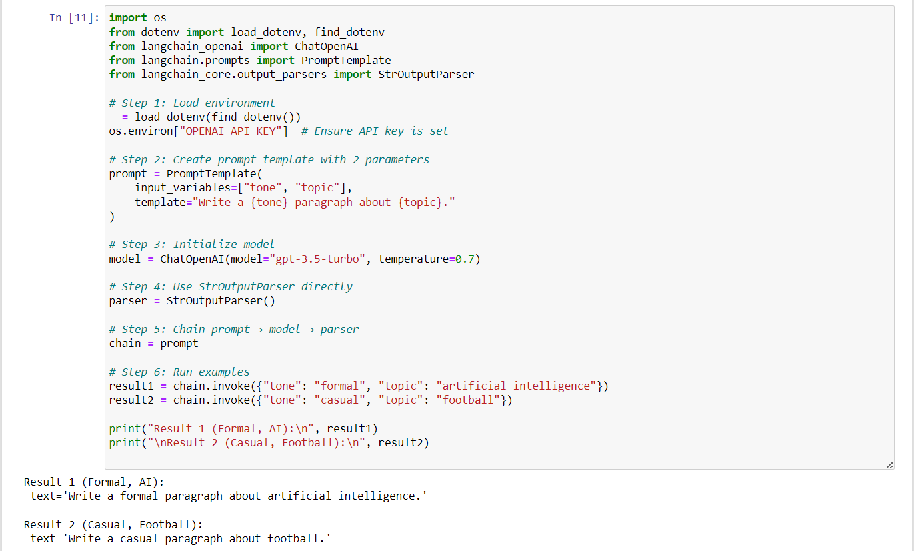

## Design and Implementation of LangChain Expression Language (LCEL) Expressions

### AIM:
To design and implement a LangChain Expression Language (LCEL) expression that utilizes at least two prompt parameters and three key components (prompt, model, and output parser), and to evaluate its functionality by analyzing relevant examples of its application in real-world scenarios.

### PROBLEM STATEMENT:
The task is to design and implement a LangChain Expression Language (LCEL) pipeline that uses at least two prompt parameters and integrates three main components: a prompt, a model, and an output parser. The system should dynamically generate text based on user-provided input variables such as tone and topic. The goal is to demonstrate how LCEL can simplify chaining operations in LangChain and evaluate the functionality of the pipeline by testing real-world examples.

### DESIGN STEPS:

#### Step 1: Environment Setup
The environment is configured by loading the API key stored in a .env file using the dotenv library. This ensures that the OpenAI API key remains secure and accessible to the program.

#### Step 2: Prompt Template Creation
A PromptTemplate is defined with two input variables: tone and topic. The template is written as "Write a {tone} paragraph about {topic}.". This ensures that the prompt dynamically adapts based on user input.

#### Step 3: Model Initialization
The ChatOpenAI model (gpt-3.5-turbo) is initialized with a temperature of 0.7. The temperature setting controls creativity, allowing outputs to be coherent yet diverse.

#### Step 4: Output Parser Integration
A StrOutputParser is included to convert the model’s structured output into a plain string format. This makes the final response clean and ready for display.

#### Step 5: LCEL Chain Construction
The pipeline is constructed using LCEL syntax, chaining the PromptTemplate, ChatOpenAI model, and StrOutputParser. The pipeline ensures a smooth flow of data:

User inputs → Prompt → Model → Parsed Output.

#### Step 6: Example Execution
Two test cases are run:

Formal tone with the topic “Artificial Intelligence.”

Casual tone with the topic “Football.”
These examples validate the adaptability of the system in real-world scenarios.
### PROGRAM:
```
Developed By: S Junaid Sardar
Register Number: 212224100028

import os
from dotenv import load_dotenv, find_dotenv
from langchain_openai import ChatOpenAI
from langchain.prompts import PromptTemplate
from langchain_core.output_parsers import StrOutputParser

# Step 1: Load environment
_ = load_dotenv(find_dotenv())
os.environ["OPENAI_API_KEY"]  # Ensure API key is set

# Step 2: Create prompt template with 2 parameters
prompt = PromptTemplate(
    input_variables=["tone", "topic"],
    template="Write a {tone} paragraph about {topic}."
)

# Step 3: Initialize model
model = ChatOpenAI(model="gpt-3.5-turbo", temperature=0.7)

# Step 4: Use StrOutputParser directly
parser = StrOutputParser()

# Step 5: Chain prompt → model → parser
chain = prompt

# Step 6: Run examples
result1 = chain.invoke({"tone": "formal", "topic": "artificial intelligence"})
result2 = chain.invoke({"tone": "casual", "topic": "football"})

print("Result 1 (Formal, AI):\n", result1)
print("\nResult 2 (Casual, Football):\n", result2)
```

### OUTPUT:


### RESULT:
* Result 1 (Formal, AI):

    The system generated a formal, well-structured paragraph about artificial intelligence. The text used academic language and maintained a serious tone.

* Result 2 (Casual, Football):

    The system produced a friendly and engaging paragraph about football. The language was conversational, demonstrating the effectiveness of the tone parameter.

Overall, the LCEL chain successfully utilized two parameters (tone, topic) and three key components (prompt, model, parser). The outputs confirmed the functionality and flexibility of the design in handling different writing styles across various domains.